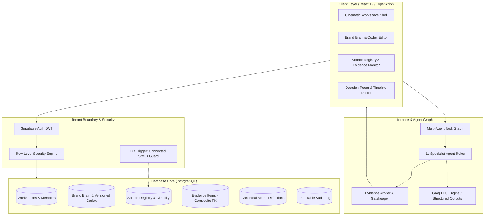

<div align="center">

# ❖ V A N T A

### **Evidence-Grounded Creative Intelligence & Autonomous Decision Engine**

<p align="center">
  <em>"Confidence is earned, not generated. Never replace missing evidence with plausible prose."</em>
</p>

[](https://www.typescriptlang.org/)
[](https://react.dev/)
[](https://vitejs.dev/)
[](https://supabase.com/)
[](https://groq.com/)
[-729B1B?style=for-the-badge&logo=vitest&logoColor=white)](https://vitest.dev/)
[](#)

[Overview](#-executive-summary) • [Architecture](#-system-architecture) • [Multi-Agent Council](#-the-creative-council-11-specialist-graph) • [Evidence Layer](#-five-class-evidence-standard) • [Database & Security](#-database-schema--tenant-isolation-rls) • [Getting Started](#-getting-started) • [Roadmap](#-implementation-roadmap)

---

</div>

## ✦ Executive Summary

**Vanta** is a high-assurance creative decision intelligence platform built for modern growth, product marketing, and performance advertising teams. 

Modern creative optimization tools suffer from a fatal flaw: **hallucinatory certainty**. They output arbitrary "virality scores," generic copy mutations, and unverifiable predictions without citing data sources or acknowledging missing context.

Vanta replaces opaque generation with **structured creative decomposition, deterministic evidence gates, multi-agent dialectic arbitration, and closed-loop outcome calibration**.

```
                 ┌──────────────────────────────────────┐
                 │       UNTRUSTED CREATIVE INPUT       │
                 │   Scripts, Ad Videos, Landing Copy   │
                 └──────────────────┬───────────────────┘
                                    │
                                    ▼
                 ┌──────────────────────────────────────┐
                 │          THE CREATIVE TWIN           │
                 │ Multi-modal decomposition into nodes │
                 └──────────────────┬───────────────────┘
                                    │
            ┌───────────────────────┴───────────────────────┐
            ▼                                               ▼
┌───────────────────────┐                       ┌───────────────────────┐
│     BRAND BRAIN       │                       │    EVIDENCE LAYER     │
│  Positioning, Claims, │                       │ Verified Connectors,  │
│  Codex, Rules & Tone  │                       │  Sources, Benchmarks  │
└───────────┬───────────┘                       └───────────┬───────────┘
            │                                               │
            └───────────────────────┬───────────────────────┘
                                    │
                                    ▼
                 ┌──────────────────────────────────────┐
                 │     11-AGENT CREATIVE COUNCIL        │
                 │   Dialectic debate & audit trials    │
                 └──────────────────┬───────────────────┘
                                    │
                                    ▼
                 ┌──────────────────────────────────────┐
                 │      EVIDENCE ARBITER (GATEWAY)      │
                 │ Rejects unbacked/stale assertions    │
                 └──────────────────┬───────────────────┘
                                    │
                                    ▼
                 ┌──────────────────────────────────────┐
                 │           DECISION PACKET            │
                 │ Inspectable matrix & mutation briefs │
                 └──────────────────────────────────────┘
```

---

## 🏛 System Architecture

Vanta is engineered with a strict **provenance-first topology**. Intelligence is never computed in isolation; every finding is bound to a cryptographically traceable evidence citation and audited within tenant boundaries.



---

## 🤖 The Creative Council (11-Specialist Graph)

Vanta orchestrates eleven specialized, deterministic agent personas. Rather than a single monolithic prompt, each agent evaluates creative material through a domain-specific lens, governed by strict JSON schemas and fallback routines:

| Agent Role | Responsibility | Input Requirements | Safe Fallback Behavior |
|---|---|---|---|
| **01. Discovery Agent** | Formulates core decision briefs and objective constraints | Brand Brain + Raw Inputs | Questions missing context; marks fields unknown |
| **02. Brand Guardian** | Validates claims against approved/prohibited boundaries | Brand Claims + Tone Guide | Flags unapproved claims as blocking violations |
| **03. Creative Analyst** | Deconstructs creative structures, pacing, hooks, and CTAs | Creative Twin Nodes | Marks missing scene metadata as unanalyzable |
| **04. Audience Strategist**| Evaluates segment alignment and emotional resonance | Brand Audience Profiles | Reverts to broad-spectrum category baseline |
| **05. Journey Simulator** | Models multi-touch cognitive progression & drop-off | Funnel Step Definitions | Labels simulations as strictly directional |
| **06. Trend Researcher** | Contextualizes creative patterns against verified RSS/news | Authorized Trend Feeds | Disables trend modifier if source is stale |
| **07. Publishing Engineer**| Audits channel formatting, timing hierarchies & constraints | Channel Policy Specs | Enforces strict technical pass/fail criteria |
| **08. Creative Director** | Synthesizes recommendations into a Decision Packet | Council Findings | Requires consensus before proposing tier-1 mutations |
| **09. Mutation Engineer** | Generates precise, diff-traceable copy/hook alterations | Unsupported Claim Flags | Refuses mutation if proof points are missing |
| **10. Experiment Manager**| Structures hypothesis testing protocols and control groups | Target Metrics | Rejects tests with ambiguous success criteria |
| **11. Outcome Analyst** | Calibrates predictive models against imported campaign CSVs | Observed Platform Data | Rejects calibration if export is incomplete |

> **The Evidence Arbiter Gate:** Sits between Council outputs and the user. If an agent asserts a numeric performance claim without a verified citation, the Arbiter rejects the finding and down-levels the decision packet to `partial` or `insufficient`.

---

## 🔬 Five-Class Evidence Standard

To eliminate AI hallucinations, every data point, benchmark, and score in Vanta is typed with an immutable **Evidence Class**:

```
 ┌─────────────────┬──────────────────────────────────────────────────────────────────────────┐
 │ Evidence Class  │ Grounding Criteria & Operational Rule                                    │
 ├─────────────────┼──────────────────────────────────────────────────────────────────────────┤
 │ 🟢 OBSERVED     │ Measured directly via authorized connectors or immutable campaign CSVs. │
 │ 🔵 SOURCED      │ Backed by an explicit, verifiable external URL or documented citation.  │
 │ 🟣 INFERENCE    │ Deterministic analytical calculation with documented assumptions.       │
 │ 🟡 SIMULATION   │ Synthetic model trajectory; strictly directional, never definitive.      │
 │ ⚪ UNKNOWN      │ Unreviewed or uncorroborated assertion; triggers guided question state.  │
 └─────────────────┴──────────────────────────────────────────────────────────────────────────┘
```

### Citability Resolution State Machine

Sources registered in Vanta transition through strict citability states:

- `verified`: Source is connected via authorized platform adapter with fresh timestamp. Allows numeric claims.
- `citable_unverified`: User-registered manual source. Can provide qualitative grounding, but **forces partial evidence state and blocks verified numeric claims**.
- `citable_stale`: Source has exceeded its configured `freshness_window_days`. Triggers re-verification warning.
- `blocked`: Source is disconnected or missing. All dependent assertions are invalidated.

---

## 🗄 Database Schema & Tenant Isolation (RLS)

Vanta enforces multi-tenant row-level security across all PostgreSQL tables. Every query executes under the authenticated user's JWT context.

```
├── 20260822000001_auth_workspaces.sql
│   ├── profiles                        # User identities & avatar metadata
│   ├── workspaces                      # Multi-tenant workspace partitions
│   ├── workspace_members               # Role-based access (owner | admin | member | viewer)
│   └── audit_events                    # Immutable ledger of all system & user operations
│
├── 20260822000002_brand_brain.sql
│   ├── brands                          # Root workspace Brand Brain positioning & promise
│   ├── brand_codex_versions            # Immutable historical snapshots of full brand state
│   ├── brand_audiences                 # Segment demographics, pain points, motivations
│   ├── brand_claims                    # Approved, Prohibited, Conditional & Unknown claims
│   ├── brand_proof_points              # Evidence backing approved claims
│   ├── brand_competitors               # Competitor positioning & watch levels
│   ├── brand_tone_guidelines           # Dimensions, approved directions, prohibited styles
│   └── brand_compliance_boundaries    # Legal, regulatory, and channel enforcement rules
│
└── 20260822000003_evidence_layer.sql
    ├── source_registry                 # Authorized connectors & manual URL sources
    │   └── Trigger: trg_block_connected_status (Blocks manual 'connected' elevation)
    ├── evidence_items                  # Assertions bound via Composite FK (source_id, workspace_id)
    └── metric_definitions              # Canonical workspace metric dictionary (UNIQUE workspace_id, metric_key)
```

### Security Invariants
1. **Zero Cross-Workspace Leakage:** Composite Foreign Keys `(source_id, workspace_id)` prevent an item in Workspace A from referencing a source in Workspace B, even if the UUID is guessed.
2. **Privilege Escalation Prevention:** Helper functions `is_workspace_member()` and `is_workspace_admin_or_owner()` are declared `SECURITY DEFINER` to avoid recursive RLS exploits.
3. **Trigger-Enforced Connector Trust:** Authenticated users cannot promote a source to `connected`. Only backend service-role processes may verify live connectors.

---

## 💻 Tech Stack & Engineering Standards

| Layer | Technology | Rationale |
|---|---|---|
| **Core Framework** | React 19 + TypeScript 5.7 | Strict type safety, React Server Component compatibility, modern concurrency |
| **Build Tooling** | Vite 6.2 | Instant HMR, ESM native bundling, optimized chunk splitting |
| **Styling & Motion** | Vanilla CSS + Framer Motion | Tokenized dark-mode aesthetic, zero Tailwind overhead, hardware-accelerated animations |
| **Icons** | Lucide React | Consistent, lightweight vector iconography |
| **Backend & DB** | Supabase (PostgreSQL 15) | Native Row Level Security, Realtime subscriptions, automated onboarding triggers |
| **Inference** | Groq LPU API | Ultra-low latency structured JSON output generation for multi-agent loops |
| **Test Runner** | Vitest 2.1 | Fast in-memory unit testing, RLS contract assertion suites |

---

## 📂 Codebase Directory Layout

```
vanta/
├── docs/                               # Durable Project Memory
│   ├── architecture.md                 # System boundaries & component topology
│   ├── blueprint-index.md              # Blueprint cross-reference sitemap
│   ├── build-state.md                  # Migration states, test logs & active ticket
│   ├── decisions.md                    # Architecture Decision Records (ADRs)
│   └── product-constitution.md         # Non-negotiable anti-hallucination rules
│
├── supabase/migrations/                # Canonical Database Schema
│   ├── 20260822000001_auth_workspaces.sql
│   ├── 20260822000002_brand_brain.sql
│   └── 20260822000003_evidence_layer.sql
│
├── src/
│   ├── components/
│   │   ├── BrandBrain.tsx              # Brand Brain & Codex snapshot management UI
│   │   └── SourceRegistry.tsx          # Sources, Evidence Items, and Metric Definitions UI
│   │
│   ├── lib/
│   │   ├── auth.ts                     # Supabase auth & workspace switcher helpers
│   │   ├── auth.test.ts                # Auth fallback unit tests
│   │   ├── brandBrain.ts               # Typed Brand Brain read/write queries & snapshots
│   │   ├── evidence.ts                 # Pure synchronous numeric claim guards & citability types
│   │   ├── evidence.test.ts            # Numeric provenance validation tests
│   │   ├── rls.test.ts                 # 8-point RLS isolation contract verification suite
│   │   ├── sourceRegistry.ts           # Source registry queries & async citability resolver
│   │   ├── sourceRegistry.test.ts      # 12 citability evaluation & freshness tests
│   │   └── supabase.ts                 # Client initialization with publishable key safety
│   │
│   ├── types/
│   │   └── database.types.ts           # Auto-generated database typings (15 tables)
│   │
│   ├── App.tsx                         # Main landing experience & tenant workspace shell
│   ├── styles.css                      # Tokenized cinematic design system
│   └── main.tsx                        # React application bootstrap
│
├── signalforge_final_blueprint.md      # Master product design blueprint (68 pages)
├── package.json                        # Scripts & dependencies
├── todo.md                             # Live execution checklist
└── vite.config.ts                      # Bundler configuration
```

---

## 🚀 Getting Started

### 1. Prerequisites
- **Node.js**: `v20.x` or higher
- **npm**: `v10.x` or higher
- **Supabase Account**: (Or local Supabase CLI instance)

### 2. Clone & Install Dependencies
```bash
git clone https://github.com/chittranshsharma/vanta.git
cd vanta
npm install
```

### 3. Configure Environment Variables
Copy `.env.example` to `.env` and provide your project credentials:
```bash
cp .env.example .env
```

```ini
# Client-safe Supabase credentials (RLS protected)
VITE_SUPABASE_URL=https://your-project-ref.supabase.co
VITE_SUPABASE_ANON_KEY=your-publishable-anon-key

# Server-side inference key (never exposed in client bundle)
GROQ_API_KEY=gsk_your_groq_api_key
```

### 4. Database Migrations
Migrations are managed in `supabase/migrations/`. Apply them sequentially using the Supabase MCP or CLI:
```bash
npx supabase db push
```

### 5. Run the Test Suite
Verify all 26 unit and contract tests pass:
```bash
npm test
```

### 6. Start the Development Server
```bash
npm run dev
```
Open `http://localhost:5173` to launch the Vanta cinematic interface.

---

## 🗺 Implementation Roadmap

- [x] **Ticket 0.1 — Durable Project Memory & Scaffold** (Docs, architecture contracts, risk register)
- [x] **Ticket 1.1 — Cinematic Public Interface** (Marketing landing page, brand narrative, feature stages)
- [x] **Ticket 2.1 — Multi-Tenant Auth & Workspaces** (Supabase Auth, RLS isolation, automated signup trigger)
- [x] **Ticket 2.2 — Brand Brain & Brand Codex** (Positioning, approved/prohibited claims, immutable snapshots)
- [x] **Ticket 3.1 — Evidence Layer & Source Registry** (Provenanced sources, 5-class evidence, metric dictionary)
- [ ] **Ticket 3.2 — Ingestion Workflows** (Structured script parser, import preview modal, CSV schema validation) `[ACTIVE]`
- [ ] **Ticket 4.1 — Creative Twin Foundation** (Multi-modal asset decomposition, feature graph extraction)
- [ ] **Ticket 4.2 — Creative Decision Matrix & Timeline Doctor** (Variant comparison, scene-level diagnosis)
- [ ] **Ticket 5.1 — Agent Task Graph & Evidence Arbiter** (Groq structured orchestration, gatekeeper validation)
- [ ] **Ticket 5.2 — Specialist Council Rollout** (11 agent personas with typed fallback matrices)
- [ ] **Ticket 6.1 — Counterfactual Simulation Lab** (Controlled variable mutation & hypothesis testing)
- [ ] **Ticket 7.1 — Trend & Publishing Intelligence** (Compliant RSS feeds, distribution timing hierarchy)
- [ ] **Ticket 8.1 — Outcome Calibration Loop** (Campaign CSV ingestion, prediction-to-actual accuracy scoring)
- [ ] **Ticket QA-1 — Real-JWT Two-User E2E Isolation Suite** (Playwright multi-tenant security verification)

---

## 📜 The Product Constitution

Every contribution to Vanta must adhere to five non-negotiable laws:

1. **The Anti-Hallucination Invariant:** Never substitute missing evidence with plausible prose or fabricated metrics. If a data point cannot be proven, render an honest `unknown` or `insufficient` state.
2. **The Provenance Rule:** No recommendation, score, or mutation brief can be presented to a user without an explicit citation to a registered source and an assigned Evidence Class.
3. **Tenant Fortress Model:** Cross-workspace data access is mathematically impossible at the database layer through RLS and composite foreign key enforcement.
4. **Inspectable Autonomy:** AI agents may diagnose, challenge, simulate, and formulate briefs, but they **never execute external publishing actions without human confirmation**.
5. **Calibrated Learning:** Directional predictions must be measured against real observed outcomes. An algorithm that cannot admit error cannot improve.

---

<div align="center">
  <sub>Built with precision by Antigravity IDE • Powered by DeepMind & Groq Engineering Principles</sub>
</div>
